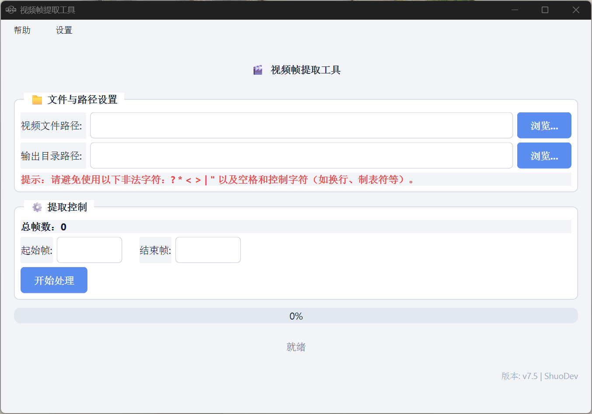
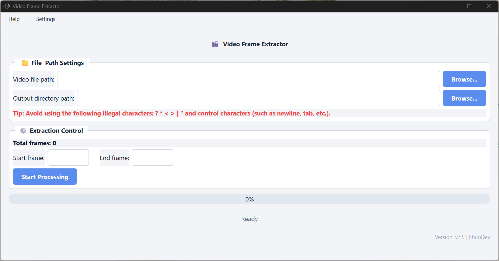

# Video-Frame-Extractor - 视频帧提取工具

[](https://github.com/ShuoDev/Video-Frame-Extractor)
[](https://github.com/ShuoDev/Video-Frame-Extractor)
[](https://github.com/ShuoDev/Video-Frame-Extractor/blob/main/LICENSE)
[-0078D6)](https://github.com/ShuoDev/Video-Frame-Extractor/releases)
---

## 📋 目录

- [简介](#简介)
- [主要特性](#主要特性)
- [界面预览](#界面预览)
- [安装步骤](#安装步骤)
- [使用说明](#使用说明)
- [路径注意事项](#路径注意事项)
- [配置与自定义](#配置与自定义)
  - [语言设置](#语言设置)
- [日志文件](#日志文件)
- [项目结构](#项目结构)
- [参与贡献](#参与贡献)
- [许可证](#许可证)
- [联系与支持](#联系与支持)

---

## 简介

**Video Frame Extractor** 是一款由纯 Python 语言编写的 Windows x64 桌面应用程序，用于将视频文件中的帧提取为高质量 JPEG 图片。它支持自定义帧范围、安全处理大文件、保留详细日志，并提供简洁现代的界面，包含多语言支持（中文和英文）。

---

## 主要特性

- **支持多种视频格式**：MP4、AVI、MOV、MKV、FLV、WMV 等（MP4 拥有最佳兼容性）。
- **灵活的帧范围设置**：可指定起始帧和结束帧（从 0 开始编号），按需提取。
- **自动分目录存储**：每 5000 帧自动创建子目录（Part1、Part2 …），方便文件管理。
- **大文件保护机制**：
  - 提取超过 **50,000** 帧时，会提示检查磁盘剩余空间。
  - 提取超过 **499,999** 帧时，程序直接拒绝处理，防止系统资源耗尽。
- **可随时中断**：点击 **“停止处理”** 即可暂停提取，已保存的帧不会丢失。
- **详细日志**：
  - `extraction_log.txt` 记录每批帧保存到哪个 Part 目录。
  - 如有错误，会生成 `extraction_errors.txt` 供排查。
- **多语言支持**：内置中文语言，并提供英文语言包（`en-US.json`），可导入自定义 JSON 语言包。更多官方语言包支持敬请期待。
- **清爽的现代化浅色主题 UI**，带进度条和状态提示。
- **源码跨平台**：源码运行支持 Windows、macOS、Linux（需 Python 环境）。

---
## 界面预览
### 主界面-中文


### Main Interface-English


---


## 安装步骤

### 1. 下载安装包

- 访问仓库主页，点击右侧 **Releases**。
- 查找最新稳定版，选择适合的安装包进行下载。

### 2. 验证完整性（安全步骤，推荐）

- 下载同目录下的 `.sha256` 校验文件。
- 执行校验：
  - **Windows**：`certutil -hashfile 文件名 SHA256`
- 对比哈希值是否一致。

### 3. 执行安装

- **Windows x64**：双击 `.exe` 文件，按向导自定义安装，完成安装。

---

## 使用说明

1. **选择视频文件**：点击 **“浏览...”** 按钮，选择目标视频。
2. **选择输出目录**：用于存放所有提取的图片和日志（建议使用空文件夹）。
3. **设置帧范围**：输入起始帧和结束帧（编号从 0 开始）。
   - 选择视频后，程序会自动显示视频总帧数。
   - 若视频少于 5000 帧，会显示 **“全部提取”** 按钮，一键提取所有帧。
4. 点击 **“开始处理”** 按钮开始提取。
   - 若提取帧数 ≥ 50,000，会弹出确认对话框，建议检查磁盘空间。
   - 若提取帧数 ≥ 500,000，程序会拒绝并提示缩小范围。
5. **监控进度**：进度条和状态标签会实时显示当前进度。
6. **随时停止**：再次点击同一按钮（此时显示 **“停止处理”**）即可中断，已保存的帧保留。
7. **查看结果**：
   - 图片保存在输出目录下的 `Part1`、`Part2` … 子文件夹中，文件名为 `frame_0000001.jpg` 等。
   - 日志文件 `extraction_log.txt` 和可能的 `extraction_errors.txt` 位于输出根目录。

---

## 路径注意事项

- 程序会检测路径中是否包含非法字符：`? * < > | "` 以及空格和控制字符（如换行、制表符等）。发现时会发出警告。
- **建议使用纯英文字符路径**以获得最佳兼容性。

---

## 配置与自定义

### 语言设置

- 程序从 `Languages/` 文件夹加载语言包（JSON 格式）。若该文件夹为空，则默认使用中文。
- 默认使用内置的中文语言。若 `Languages/` 中存在有效的 JSON 文件，将优先使用第一个文件覆盖内置中文字符串。
- 可通过菜单栏 **“设置”** 切换语言。
- **自定义语言包格式**：
  ```json
  {
    "language_code": "en-US",
    "app_title": "Video Frame Extractor",
    "menu_help": "Help"
  }
 （所有键值可参考源码中的 load_builtin_language 方法）
- 导入新语言包后，部分界面可能需要重启程序才能完全刷新。

## 日志文件
- extraction_log.txt：记录每次提取任务中每批帧保存到哪个 Part 目录。
- extraction_errors.txt：仅在发生错误时生成，包含时间戳和错误详情，便于调试。

## 项目结构
	Video-Frame-Extractor/
	├── VFE.py                  # Python源代码
	├── ico/                    # 应用图标文件夹（程序依赖）
	│   ├── VFE_w.ico           # 程序窗口图标
	│   ├── VFE_b.ico           # 程序图标
	│   └── Github.ico          # GitHub 图标
	├── screenshots/            #截图文件夹
	│	├── Window_zh.png          
	│   	└── Window_en.png
	├── requirements.txt        # Python 依赖列表
	├── README.md               # 介绍文档
	├── LICENSE                 # MIT 许可证文件
	├── .gitignore              # Git 忽略规则
	├── Languages/              # 外部语言包（JSON 文件）
	│   └── (默认为空)           # 为空时默认中文
	└── en-US.json              # 附件（可选）放入Languages文件夹用于程序英文支持
	
## 参与贡献
欢迎任何形式的贡献！无论是报告 Bug、提出新功能建议，还是提交代码，我们都非常感谢！

## 许可证
本项目采用 MIT 许可证，详见 LICENSE 文件。

## 联系与支持
作者：ShuoDev
GitHub 仓库：https://github.com/ShuoDev/Video-Frame-Extractor
问题反馈：请使用 GitHub Issues 页面报告 Bug 或请求功能。

感谢您使用 Video-Frame-Extractor！ 如果您觉得这个工具有帮助，请考虑给仓库点个 ⭐，您的支持是我们持续改进的动力！
